# 포트폴리오

<aside>
💡 🥇 **최우수상 수상** 🥇

</aside>

## 돌봇

서비스 내용 : 홈IoT 로봇을 이용한 독거 노인 돌봄 서비스

- 서비스 주요 기능 :
    - 로봇
        - 자율주행, 로봇 제어(SLAM, Path Planning, Follow the carrot)
        - 원격 IoT 가전 제어(UDP)
        - 음성을 통한 가전 기기 제어
        - 실시간 일정 알림
        - 응급 상황 감지 및 보호자 연락
        - 객체 인식 및 객체 추종
    - 어플
        - 실시간 스트리밍을 통한 영상 송출
        - 가전 기기 제어
        - 일 단위 로그 확인
        - 일정 등록
        
- 개발기간 : 2022.02.20~2022.04.07 (7주)
- 플랫폼 : 어플
- 담당 역할 : 6명
    - 정찬영 (팀장)  : ROS2기반 로봇 시스템 제어/알고리즘 구현 (SLAM, Path Planning, Follow the carrot), UDP통신 기반 IoT 기기 제어 기능 구현, 앱 - 로봇간 Socket 통신 구현
    - 김정민 : Backend(로그인, 로봇 세팅, 스케줄, 테스트 코드)
    - 기성도 : Frontend(UI/UX 담당)
    - 김원혁 : Unity 객체 생성 및 애니메이션 구현 , openCV, Lidar 센서를 이용한 객체 추종 구현, Dijkstra 알고리즘 구현
    - 이가옥 : ROS2, 일정알람, 음성제어 (TTS/STT), 임베디드-백엔드 연동(REST API), 임베디드-프론트 연동(Socketio), 영상 송출 (CCTV 기능)
    - 김도원 : Backend(스케줄, 로그, 소켓 서버), 배포
    
- 개발 환경
    - 언어 : Java11, Python, Dart
    - 서버 : AWS EC2, Ubuntu
    - 프레임워크 : Spring, Flutter, ROS2
    - DB : Mysql, S3
    - IDE : IntelliJ, VS code
    - API, 라이브러리 : Google Cloud Speech-to-text API, Socket IO
    - 통신 프로토콜 : WS, HTTPS, UDP

- 시연 영상 : [https://www.youtube.com/watch?v=JUCa4dl0fJo](https://www.youtube.com/watch?v=JUCa4dl0fJo)
- UCC : [https://youtu.be/yobItHNKP1M](https://www.youtube.com/watch?v=U6sROxQxg14)

## 서비스 소개

❓전자기기를 다루기 어려운 노인 분들을 돕는 로봇이 있을까요?

❓말로 설명해도 알아 듣는 로봇이 있을까요?

❓앱으로 어르신의 집을 관리 할 수 있을까요? 

❓집에 어르신이 잘 계신지 직접 눈으로 확인 할 수 있을까요?

이 모든 기능을 가진 스마트홈 로봇 서비스 프로젝트

## 아키텍처(기술스택)

## 서비스 특장점

- 보호자를 위한 서비스
    - 원격 가전 제어(앱)
    - 보호 대상자 스케줄 관리
    - 알림 및 로그 제공
    - CCTV 열람
    - 보호 대상자의 응급상황 파악
- 어르신을 위한 서비스
    - 원격 가전 제어 (음성)
    - 일정 알림
    - 응급 상황을 보호자에게 알림
    - 24시 돌봄 서비스 (추종)
- 3자 통신
    - 프론트엔드 - 백엔드 - 로봇 3자간 통신

## 기능 명세서

## ERD

.png)

## API 설계서

### REST API 명세서

### SOCKET TOPIC

## 서비스 목업

## 페이지 나열

- 로그인

- 메인페이지

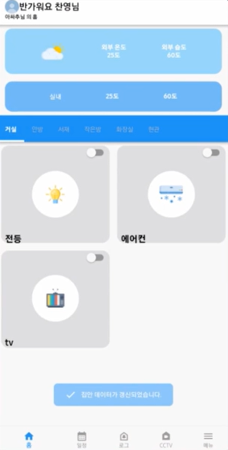

- 방별 가전 목록 및 상태

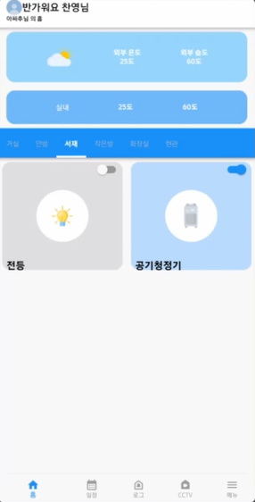

- 에어컨 상세 작동 설정

- CCTV(수동모드)

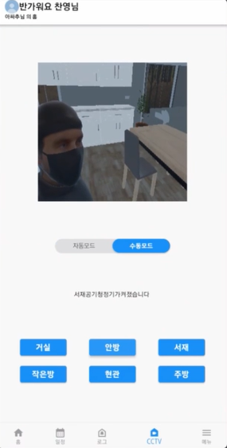

- CCTV(수동모드)

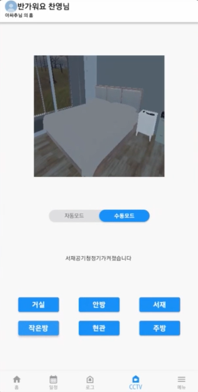

- CCTV(수동모드)

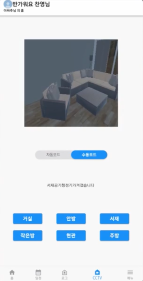

- 일정 리스트

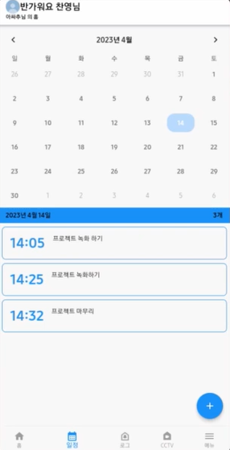

- 스케줄러

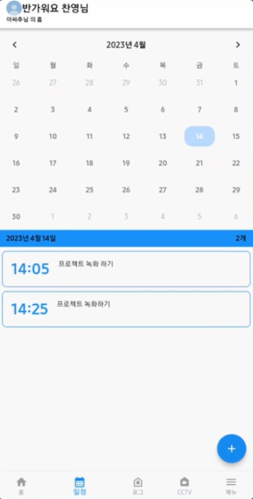

- 일정 추가 및 수정

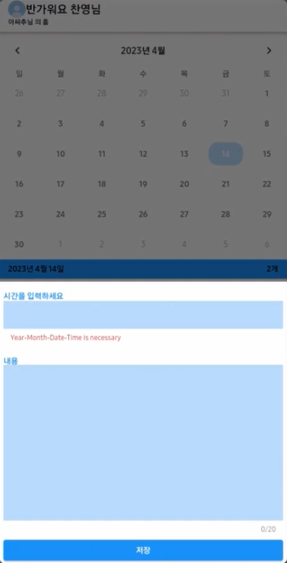

- 일정 알림 시간 설정

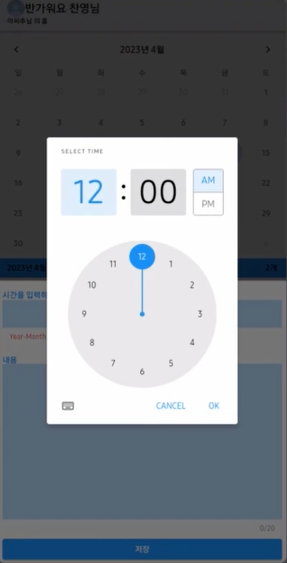

- 긴급 알림

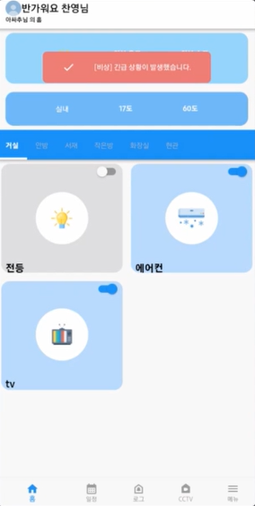

- 일 단위 로봇 작동 로그
    
    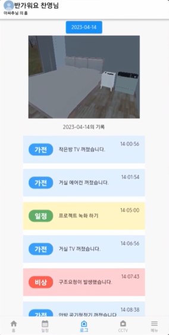
    

## 프로젝트 일정 관리

.png)
