*2023-03-23 진행 상황*

- # **Unity Asset 생성**

  - ### 주요 캐릭터 생성

    - Unity Asset Store로부터 받은 캐릭터에 Idle- Walk - fall 등의 애니메이션을 입히는 작업
    - 캐릭터 자체를 Build하여 시뮬레이터 안으로 가지고 오는 작업

    - 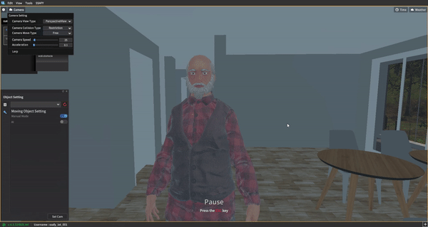

  - ### 시뮬레이터 내부 공간 구성

    - 방 세 개 (침실, 서재, 휴게 공간), 화장실 , 주방 & 거실 구성

    - 가전의 경우 통신에 사용될 절대 좌표가 Fix 되어야하기 때문에 현재 위치로 고정

    - 나머지 인테리어의 경우 화장실 변기와 같이 Asset Store에서 import 해서 사용할 수 있다는 것을 확인했기 때문에 추후에 좀 더 세밀하게 구성 예정

    - ##### 거실 및 주방 

    - 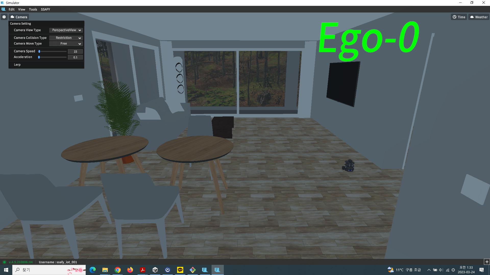

    - ##### 서재

    - 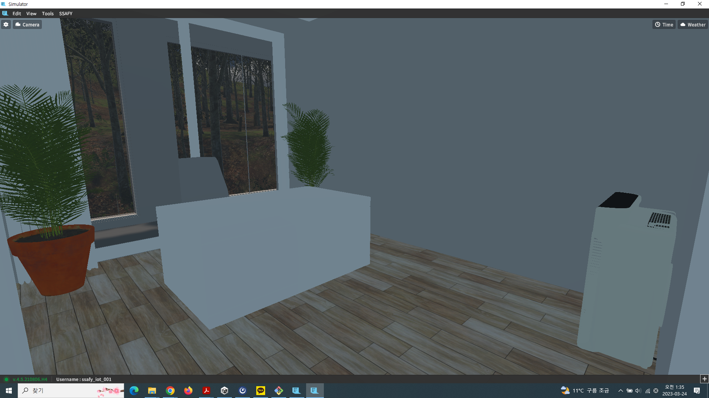

    - ##### 침실

    - 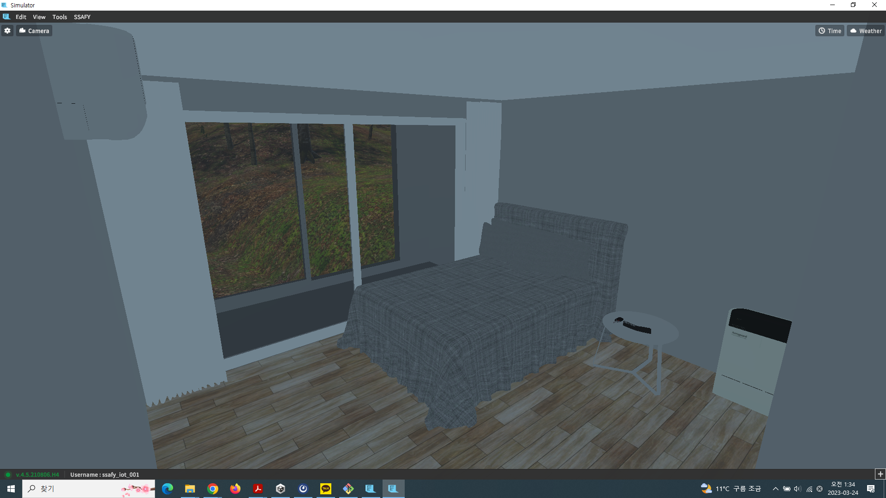

    - ##### 화장실 

    - 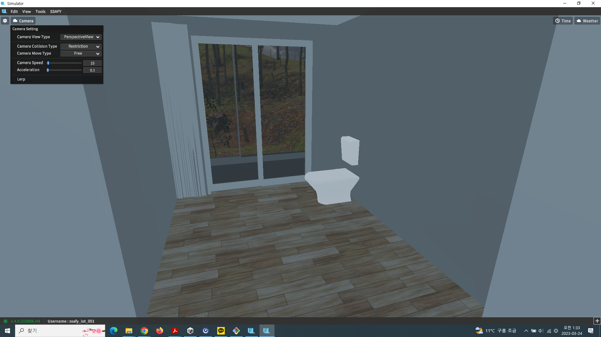

    - ##### 휴게 공간

    - 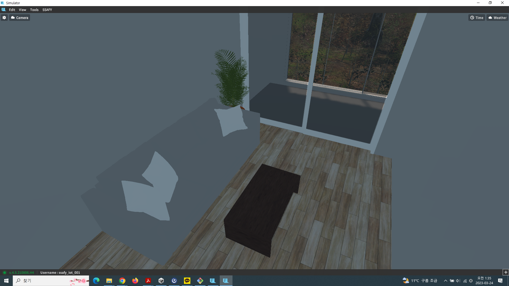

​		

*2023-03-25 진행 상황*

- ##### 설계 도면 완성

- 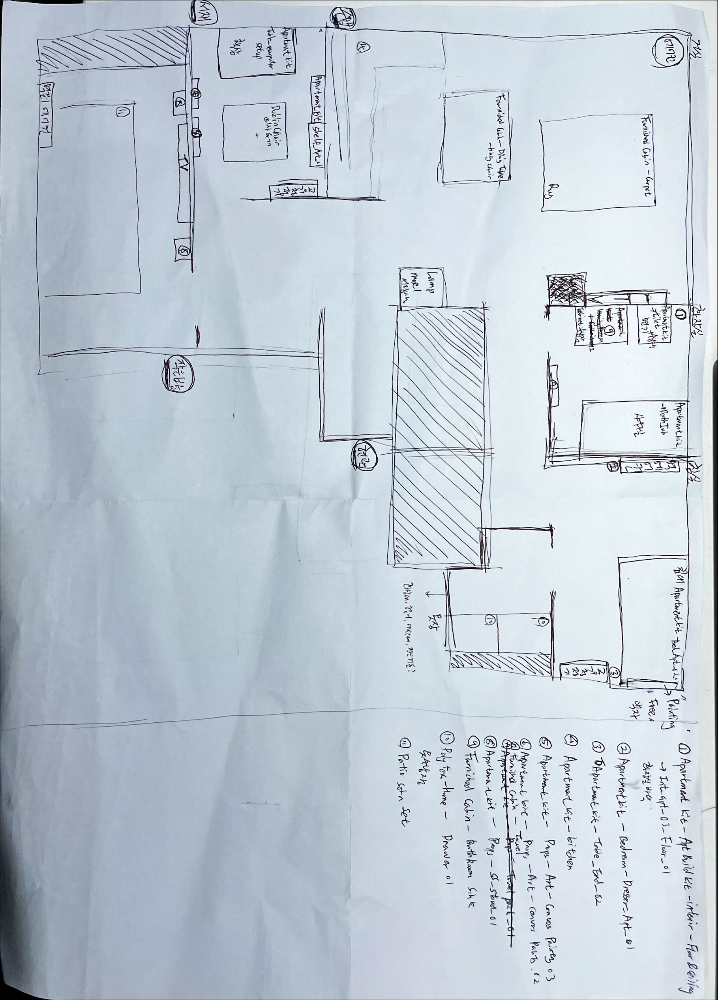

*2023-03-26 진행 상황*

- ### 시나리오 파일 저장 

  - home.json이라고 되어 있는 파일을 다음의 경로에 추가 후 시뮬레이터 안에서 Load해오면 된다.
  - SSAFYLauncher_SSAFY_Win\SSAFYLauncher_SSAFY_Win_Data\SaveFile\Scenario\V_IND_SmartHome3

- ### 시뮬레이터 가구 배치 완료

  - 거실
  - 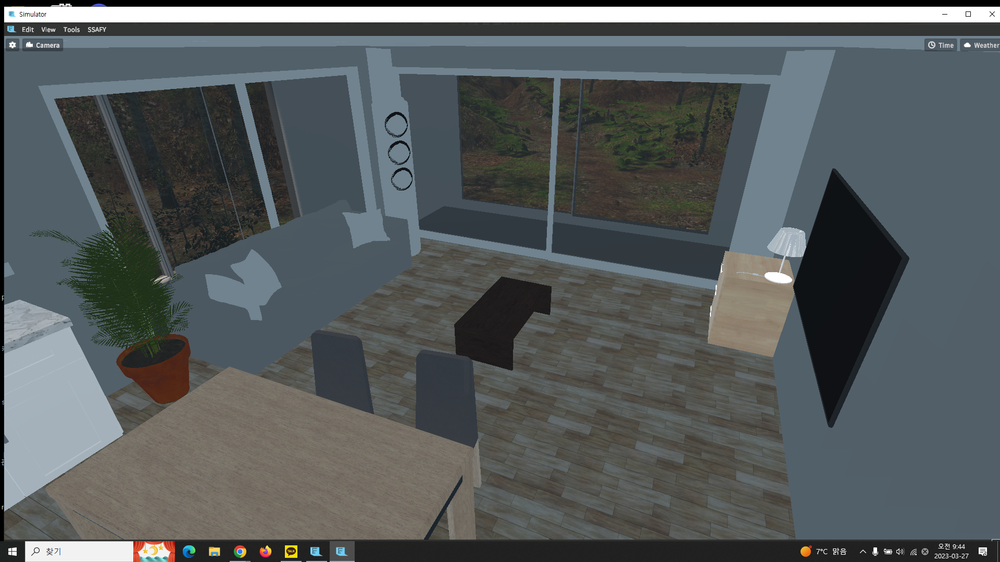
  - 주방
  - 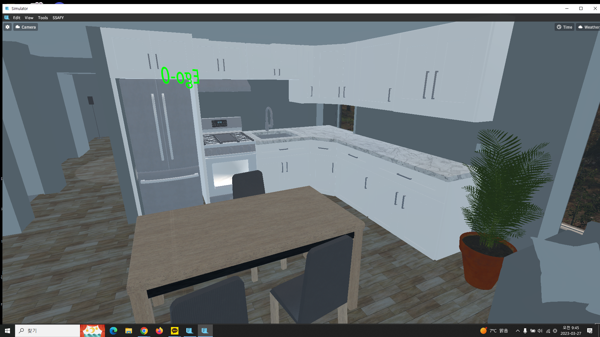
  - 작은방
  - 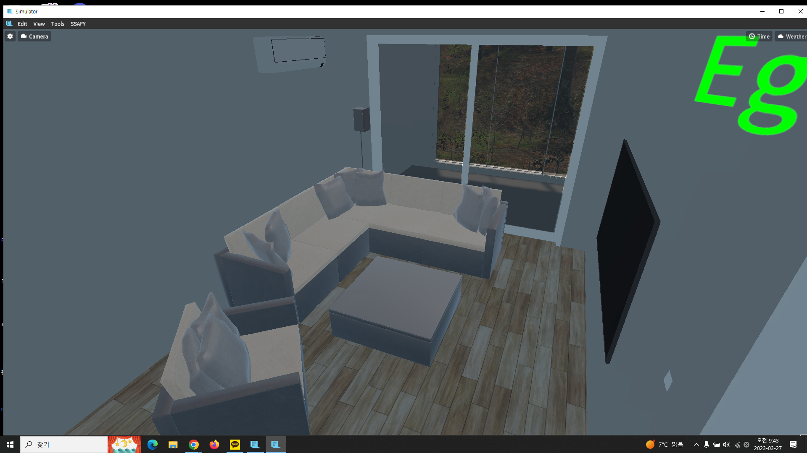
  - 옷방
  - 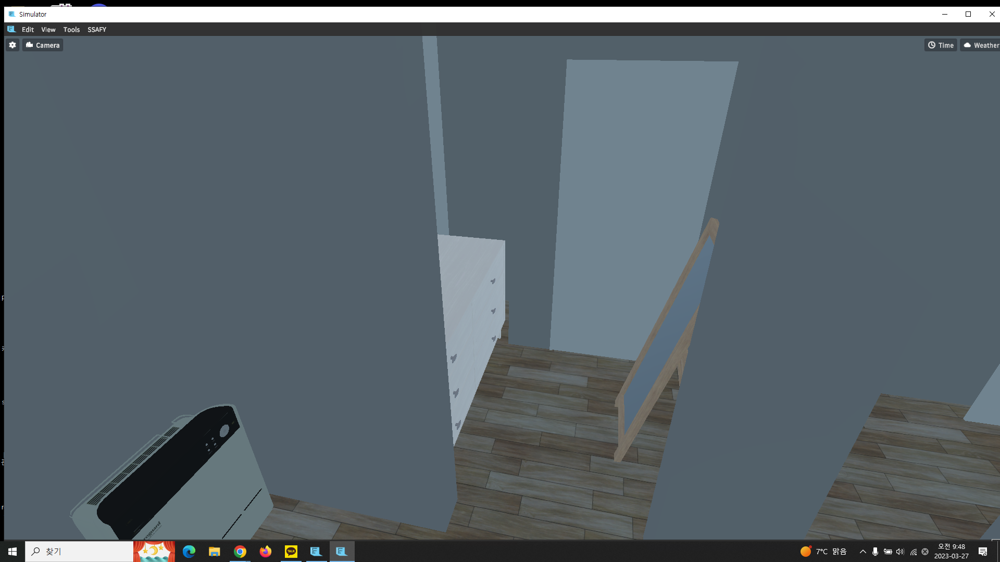
  - 화장실
  - 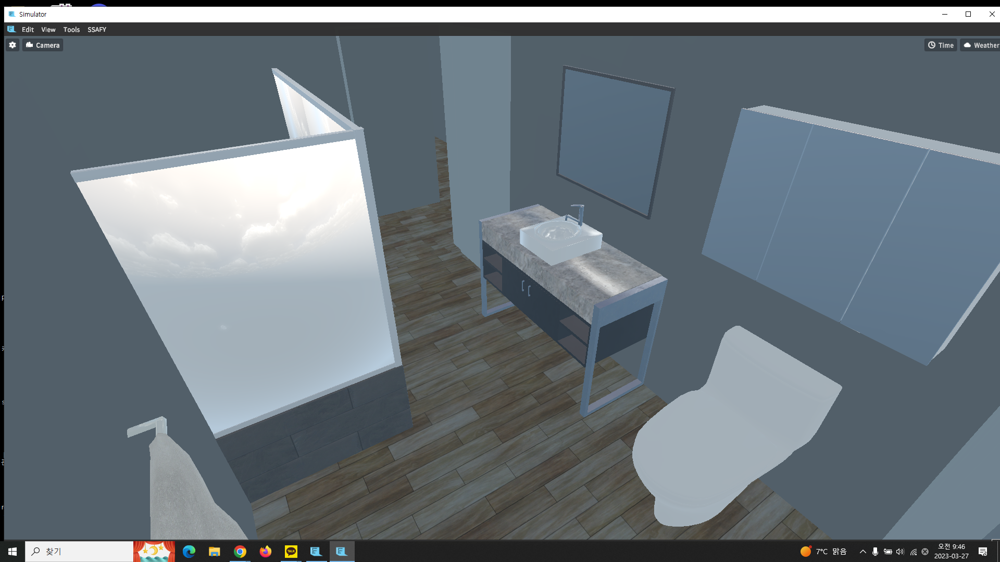
  - 침실
  - 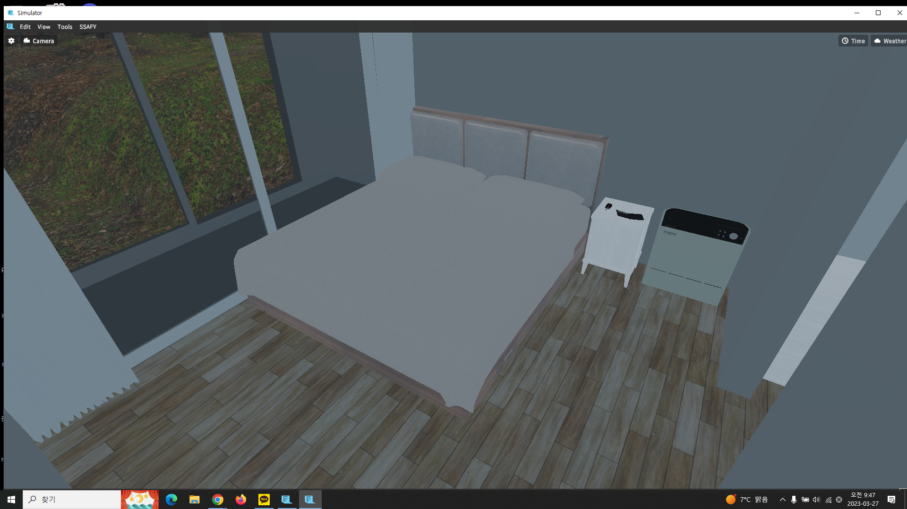
  - 서재
  - 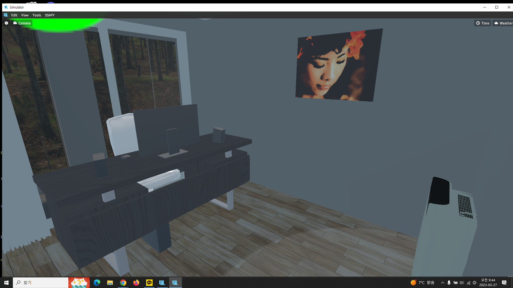

*2023-03-28 진행 상황*

- ### 중복된 에셋 제거
  - TV가 같은 위치에 두 개 위치하여 제거
- ### 에어컨 위치가 가구 배치에 의해 컨트롤 할 수 있는 범위에서 벗어나 위치 변경

