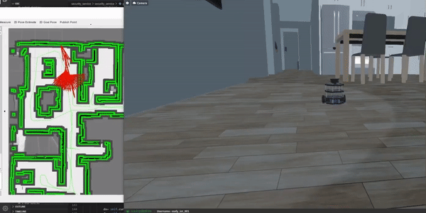

2023-03-21 A* 알고리즘 완성

2023-03-29 human_detector , OpenCV +Lidar 좌표 변환 완성

2023-04-04 human detector + lidar 데이터를 이용하여 사람의 Map 상 절대 좌표 도출

로봇의 임수 수행 후 원래의 경로로 돌아왔을 떄 사람이 없을 경우 patrol 돌 수 있는 코드 구현

 
